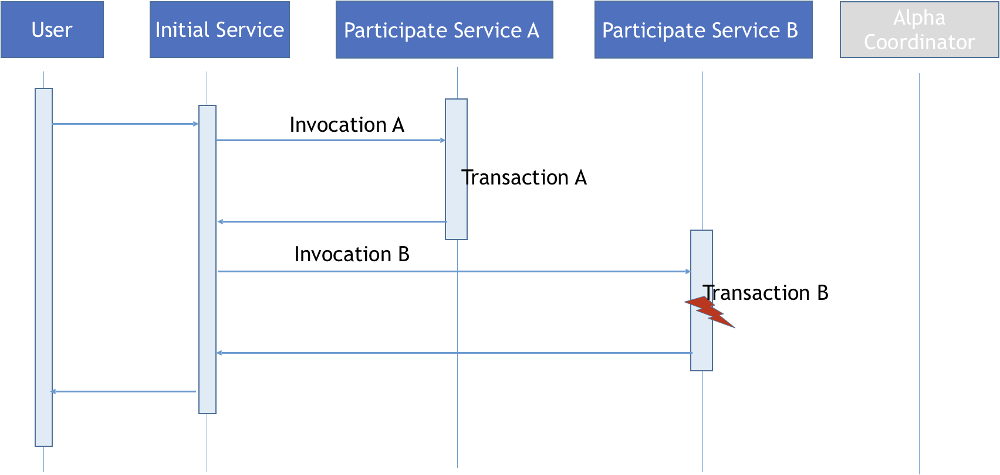

# Saga Pack 设计文档

## 业务背景介绍
下图展示了一个典型的分布式事务调用， 用户请求触发分布式服务调用， 初始服务会顺序调用两个参与服务（服务A，服务B）。当服务A执行成功，而服务B执行出现了问题，我们这个分布式事务调用需要调用服务A的补偿操作来确保分布式事务的一致性（单个事务失败，整个分布式事务需要进行回滚），由于这两个参与服务之间没有联系，因此需要一个协调器来帮助进行相关的恢复。

分布式事务的在执行补偿的过程中，我们可以根据补偿执行的不同将其分成两组不同的补偿方式：
* 不完美补偿（Saga） - 补偿操作会留下之前原始事务操作的痕迹，一般来说我们是会在原始事务记录中设置取消状态。
* 完美补偿（TCC) - 补偿操作会彻底清理之前的原始事务操作，一般来说是不会保留原始事务交易记录，用户是感知不到事务取消之前的状态信息的。

## 概览
Pack中包含两个组件，即 **alpha** 和 **omega**。
* alpha充当协调者的角色，主要负责对事务的事件进行持久化存储以及协调子事务的状态，使其得以最终与全局事务的状态保持一致。
* omega是微服务中内嵌的一个agent，负责对网络请求进行拦截并向alpha上报事务事件，并在异常情况下根据alpha下发的指令执行相应的补偿操作。

## Omega内部运行机制
omega是微服务中内嵌的一个agent。当服务收到请求时，omega会将其拦截并从中提取请求信息中的全局事务id作为其自身的全局事务id（即Saga事件id），并提取本地事务id作为其父事务id。在预处理阶段，alpha会记录事务开始的事件；在后处理阶段，alpha会记录事务结束的事件。因此，每个成功的子事务都有一一对应的开始及结束事件。

## 服务间通信流程
服务间通信的流程与[Zipkin](https://github.com/openzipkin/zipkin)的类似。在服务生产方，omega会拦截请求中事务相关的id来提取事务的上下文。在服务消费方，omega会在请求中注入事务相关的id来传递事务的上下文。通过服务提供方和服务消费方的这种协作处理，子事务能连接起来形成一个完整的全局事务。

## Pack的架构图
我们可以从下图进一步了解ServiceComb Pack架构下，Alpha与Omega内部各模块之间的关系图。

整个架构分为三个部分，一个是Alpha协调器（支持多个实例提供高可用支持），另外一个就是注入到微服务实例中的Omega，以及Alpha与Omega之间的交互协议， 目前Pack支持Saga 以及TCC两种分布式事务协调协议实现。

### Omega
Omega包含了与分析用户分布式事务逻辑相关的模块 事务注解模块（Transaction Annotation） 以及 事务拦截器（Transaction Interceptor）； 分布式事务执行相关的事务上下文（Transaction Context），事务回调（Transaction Callback) ，事务执行器 （Transaction Executor）；以及负责与Alpha进行通讯的事务传输（Transaction Transport）模块。

事务注解模块是分布式事务的用户界面，用户将这些标注添加到自己的业务代码之上用以描述与分布式事务相关的信息，这样Omega就可以按照分布式事务的协调要求进行相关的处理。如果大家扩展自己的分布式事务，也可以通过定义自己的事务标注来实现。

事务拦截器这个模块我们可以借助AOP手段，在用户标注的代码基础上添加相关的拦截代码，获取到与分布式事务以及本地事务执行相关的信息，并借助事务传输模块与Alpha进行通讯传递事件。

事务上下文为Omega内部提供了一个传递事务调用信息的一个手段，借助前面提到的全局事务ID以及本地事务ID的对应关系，Alpha可以很容易检索到与一个分布式事务相关的所有本地事务事件信息。

事务执行器主要是为了处理事务调用超时设计的模块。由于Alpha与Omega之间的连接有可能不可靠，Alpha端很难判断Omega本地事务执行超时是由Alpha与Omega直接的网络引起的还是Omega自身调用的问题，因此设计了事务执行器来监控Omega的本地的执行情况，简化Omega的超时操作。目前Omega的缺省实现是直接调用事务方法，由Alpha的后台服务通过扫描事件表的方式来确定事务执行时间是否超时。

事务回调 在Omega与Alpha建立连接的时候就会向Alpha进行注册，当Alpha需要进行相关的协调操作的时候，会直接调用Omega注册的回调方法进行通信。 由于微服务实例在云化场景启停会很频繁，我们不能假设Alpha一直能找到原有注册上的事务回调， 因此我们建议微服务实例是无状态的，这样Alpha只需要根据服务名就能找到对应的Omega进行通信。

### Transport

事务传输模块负责Omega与Alpha之间的通讯，在具体的实现过程中，Pack通过定义相关的Grpc描述接口文件定义了TCC 以及Saga的事务交互方法， 同时也定义了与交互相关的事件。我们借助了Grpc所提供的双向流操作接口实现了Omega与Alpha之间的相互调用。 Omega和Alpha的传输建立在Grpc多语言支持的基础上，为实现多语言版本的Omega奠定了基础。

### Alpha

Alpha为了实现其事务协调的功能，首先需要通过事务传输（Transaction Transport）接收Omega上传的事件， 并将事件存在事件存储（Event Store）模块中，Alpha通过事件API (Event API）对外提供事件查询服务。Alpha会通过事件扫描器（Event Scanner）对分布式事务的执行事件信息进行扫描分析，识别超时的事务，并向Omega发送相关的指令来完成事务协调的工作。由于Alpha协调是采用多个实例的方式对外提供高可用架构， 这就需要Alpha集群管理器（Alpha Cluster Manger）来管理Alpha集群实例之前的协调。用户可以通过管理终端（Manage console）对分布式事务的执行情况进行监控。

目前Alpha的事件存储是构建在数据库基础之上的。为了降低系统实现的复杂程度，Alpha集群的高可用架构是建立在数据库集群基础之上的。 为了提高数据库的查询效率，我们会根据事件的全局事务执行情况的装将数据存储分成了在线库以及存档库，将未完成的分布式事务事件存储在在线库中， 将已经完成的分布式事务事件存储在存档库中。

事件API是Alpha对外暴露的Restful事件查询服务。 这模块功能首先应用在Pack的验收测试中，通过事件API验收测试代码可以很方便的了解Alpha内部接收的事件。验收测试通过模拟各种分布式事务执行异常情况（错误或者超时），比对Alpha接收到的事务事件来验证相关的其事务协调功能是否正确。

管理终端通过访问事件API提供的Rest服务，向用户提供是分布式事务执行情况的统计分析，并且可以追踪单个全局事务的执行情况，找出事务的失败的原因。

Alpha集群管理器负责Alpha实例注册工作，管理Alpha中单个服务的执行情况， 并且为Omega提供一个及时更新的服务列表。 通过集群管理器用户可以轻松实现Alpha服务实例的启停操作，以及Alpha服务实例的滚动升级功能。

## Saga 具体处理流程
Saga处理场景是要求相关的子事务提供事务处理函数同时也提供补偿函数。Saga协调器alpha会根据事务的执行情况向omega发送相关的指令，确定是否向前重试或者向后恢复。
### 成功场景
成功场景下，每个事务都会有开始和有对应的结束事件。

### 异常场景
异常场景下，omega会向alpha上报中断事件，然后alpha会向该全局事务的其它已完成的子事务发送补偿指令，确保最终所有的子事务要么都成功，要么都回滚。

### 超时场景 (需要调整）
超时场景下，已超时的事件会被alpha的定期扫描器检测出来，与此同时，该超时事务对应的全局事务也会被中断。

## TCC 具体处理流程
TCC(try-confirm-cancel)与Saga事务处理方式相比多了一个Try方法。事务调用的发起方来根据事务的执行情况协调相关各方进行提交事务或者回滚事务。
### 成功场景
成功场景下， 每个事务都会有开始和对应的结束事件

### 异常场景
异常场景下，事务发起方会向alpha上报异常事件，然后alpha会向该全局事务的其它已完成的子事务发送补偿指令，确保最终所有的子事务要么都成功，要么都回滚。

